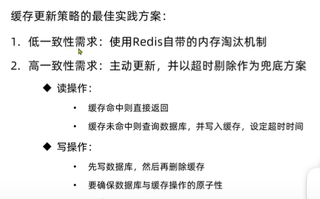
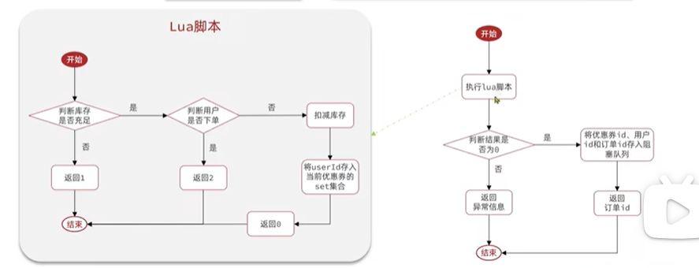
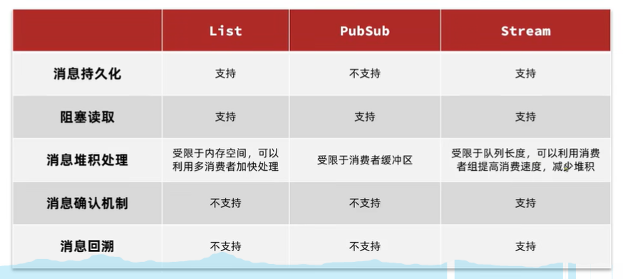
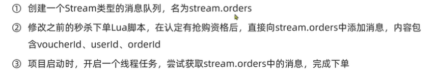

# Comment Project

## 用户登录——基于Session
为了保证线程安全。用户的信息需要线程安全。这需要用到ThreadLocal：当服务器收到用户发来的请求后，服务器会针对这个请求创建一个线程，
在拦截器(Interceptor)获得cookie之后，它可以用来找到对应的session， 服务器中存有若干session，session中匹配了合适的用户session
(通过用户发过来的Cookie，就是key是JSESSIONID的这个，比如JSESSIONID=19B2BCFF022976521321320D807253FB)。如果是首次访问，服务器
会给客户端发送一个cookie(key 是 JSESSIONID，value 是一串奇怪的东西)，并在服务器自身创建并储存一个session。session中存有该用户的信息(我们的
User实体类)，然后将它储存到ThreadLocal中即可保证线程安全。

ThreadLocal 创建的是线程的私有变量，每个线程都可以独立地改变自己的变量副本而不影响其他线程中的变量副本。一个线程可以创建多个不同的 ThreadLocal，
这些不同的 ThreadLocal 构成的键值对隶属于同一个 ThreadLocalMap。 
每个线程内部包含一个ThreadLocalMap变量，它是一个 HashMap，可以储存多个键值对，每个键值对是<ThreadLocal, Object>类型的键值对， 
键是 ThreadLocal 这个变量自身的引用(this/地址)，值就是不同 ThreadLocal 的值。
每个线程持有自己的 ThreadLocalMap 实例，这个映射表存储了该线程使用的所有 ThreadLocal 对象及其对应的值。
这种设计确保了不同线程的 ThreadLocal 变量互不干扰，实现了线程间的数据隔离。
提示：人类一般将 ThreadLocal 声明为 static，以实现同一个线程内的共享。

一个问题：为什么人类需要使用ThreadLocal，而不直接使用session获取用户信息？
有一种说法是：从线程中取用户信息会导致线程不安全
服务器（如Tomcat、Jetty等）会为每个进入的HTTP请求分配一个线程（从线程池中）来处理，也就是说：一个请求就是一个线程。

## 用户登录——基于Redis
那么这种通过session的办法会带来什么问题？
session共享问题：多台TOMCAT不共享session存储空间，请求切换到不同tomcat服务器会导致数据丢失
一些解决：session拷贝(浪费空间，拷贝延迟可能带来数据的不一致性)
session的替代方案应该满足：①数据共享；②内存存储；③key，value结构。所以需要用Redis

在保存验证码的过程中，替换为Redis后，如何设置key？
服务端只有一个 Redis ，而 session 是每个用户都有一个，如果我们将 key 储存为 "code"，那么有很多 user 的验证码都叫 code，
这会直接发生冲突，因此，每个用户的key需要是不同的。比如：手机号作为 key (tomcat会自动维护和创建session等)，value 就是验证码

随后，也需要保存用户到 Redis，用户对象需要 string --> json 序列化 // 另一个方案是 hash(map)，注意：
公司用的 string 是更多的。当然，hash 会更节省空间， string 会有括号、冒号、逗号等冗余。**本项目采用HASH**
此外，redis如何存储用户信息？答：随机生成一个 token 作为 key。value 再使用 hash 存储每个字段即可。
现在用户发送请求，需要带着 token，所以需要手动把 token 返回给前端(失去了JSSSIONID的自动匹配session)，使得客户端每次
请求应该都携带 token (这个携带 token 的功能由前端完成)

登录拦截器的优化：
如果用户访问的一直是无需登录(不经过拦截器)的页面或者路径，那么TOKEN不会被刷新，那么30分钟后，token会失效，这是不太合理的。
为此，需要一个解决方案：比如，再加一个拦截器，它专门用于刷新 token，保存用户，并放行所有请求；第二个拦截器再做拦截动作(第二个拦截器只做拦截)

```angular2html
Redis 登录流程总结：
①用户输入手机号，点击获取验证码，然后服务器生成验证码，将 手机号 + 验证码 存储在 Redis 中，2 min 内有效
②当用户输入验证码点击登录，(该过程不经过拦截器)，服务器获得验证码，与Redis中的验证码进行比对以验证其有效性，随后根据手机号查询用户信息(如果没有就注册)，
  然后将查询出的信息(脱敏，UserDTO)储存在 Redis 中，key 是 token，value 是UserDTO，30 min 有效
③随后访问需要登录的地方就经过拦截器(当然，更新后所有路径都经过第一个拦截器，它不负责拦截，但可以刷新token的有效期)，验证登录即可。如果访问了需要登录
  的路径，就把 UserDTO 存入 ThreadLocal 以实现线程安全。
```

## 商户缓存查询

**什么是缓存？** cache 临时存储数据的地方，一般读写性能较高

浏览器缓存：比如缓存静态资源。当浏览器缓存未命中，则去TOMCAT的Redis查询，如果redis未命中，则向数据库MySQL中查找
缓存的作用：①降低后端负载(减少读取MySQL的次数)；②提高读写效率，降低响应时间
缓存的成本：①数据的一致性成本；②一致性带来的代码维护成本；③运维成本

**添加Redis缓存**
添加缓存相当于添加中间层，优先从Redis中查找，如果Redis中没有就从数据库中查找。
当请求命中，不到数据库中。如果未命中，则需要双写，将数据返回给用户的同时，写入 redis

注意：list只能存储string，需要手动序列化，如果使用Gson，需要自己写@GsonIgnore注解，并实现响应接口以忽略这些字段

**缓存更新策略**
内存淘汰机制：
1. 内存淘汰：不用自己维护，利用redis的内存淘汰机制，当内存不足时淘汰部分数据，下次查询时更新缓存 
   缺陷：可能导致旧数据一直不被淘汰(数据库更新了该字段，但是redis及时命中，导致查到的永远是旧数据)
   一致性：差。维护成本：无。
2. 超时剔除：给缓存数据添加TTL时间，到期后自动删除缓存，下次查询时更新缓存。
   一致性：一般(比如30min expire，则数据库更新频率 > 30 min，可以保证一致性)；维护成本低
3. 主动更新：编写业务逻辑，在修改数据库同时，更新缓存；一致性：好。维护成本：高。

上述策略的使用取决于业务场景
1. 低一致性需求：使用内存淘汰机制。例如店铺类型的查询缓存(可能加上超时)
2. 高一致性需求：主动更新，并以超时剔除作为兜底方案，例如店铺详情查询的缓存

**主动更新策略：如何保证双写一致性？**
1. cache aside pattern 由缓存调用者，在更新数据库的同时更新缓存 [本项目采用]
2. write behind caching pattern 调用者只操作缓存，由其它线程异步将缓存数据持久化到数据库，保证最终一致
3. 将缓存与数据库整合为一个服务，由服务维护一致性

**cache aside pattern 的细节**
1. 删除缓存还是更新缓存？
   更新缓存：每次数据库更新都更新缓存(无论更新的字段是否再redis，都写入缓存)，如果写多查少，会导致无效写操作较多
   删除缓存：更新数据库时让缓存失效，查询时再更新缓存(重新写入缓存)[本项目采用]
2. 保证操作原子性：缓存与数据库操作同时成功或者失败
   单体系统：缓存与数据库放在一个事务(不关注线程安全)
   分布式系统，TCC等分布式事务方案
3. 线程安全问题：先操作缓存还是先操作数据库？(视频38的分析)
   提示：先操作数据库，再删除缓存 方案出现问题的概率更低[需要满足：线程1查询时恰好缓存过期，写入缓存之前线程2更新了数据库并删除缓存]，
   即便出现问题， 可以使用超时时间，万一写入旧数据，一段时间后也可以被清除。

4. (原则：先执行慢的操作，再执行快的操作)，避免一个普通操作和一个慢操作之间趁虚而入其它线程的快操作

**缓存穿透**
客户端请求的数据在缓存和数据库中都不存在，这种情况下，此类请求永远会向数据库发送。缓存失效。
解决方案：
1. 缓存空对象，实现简单，维护方便；缺点：额外内存消耗(当然可以设置较短TTL)，造成短期不一致(比如id=4不存在，redis存入
   了一个null，而向数据库插入了id=4的记录，则在redis id=4的缓存到期之前，数据不一致；当然，这个问题可以通过 insert 时删一下 redis 即可)
2. 布隆过滤器，相当于在 客户端 --> redis --> MySQL 加了一层，客户端 --> 布隆过滤器 --> redis --> MySQL
   请求发过来后，先去布隆过滤器查询该记录是否存在，如果存在就放行，不存在就拒绝请求
   布隆过滤器的原理：bitmap，把数据库的数据经过一些哈希算法存到bitmap中，判断对应的位置是0 / 1
   布隆过滤器不存在是绝对的，布隆过滤器提示存在，数据却也可能不存在
   布隆过滤器优先：内存占用少，没有多余key；缺点：实现复杂，存在误判可能

解决缓存穿透：本项目使用缓存空对象。然后设置较短的TTL(没有插入数据库时删除缓存的操作)。
可能的优化：如果插入了一条记录，那么就删除空缓存。

**缓存雪崩**
同一时段大量缓存key同时失效或者Redis服务宕机(宕机才是最严重的)，导致大量请求到达数据库
解决方案
1. 给不同的key的TTL添加随机值(防止大量key同时失效)
2. 利用Redis集群提高服务可用性[哨兵模式：在集群模式下，监控Redis各个节点是否正常，如果主节点故障通过发布订阅模式通知其他节点，
   并进行故障转移，将其他正常的从节点指定为主节点。]
3. 给缓存业务加降级限流策略(比如快速拒绝服务，防止请求打入数据库)
4. 给业务添加多级缓存(L1 cache / L2 cache / L3 cache ... )

**缓存击穿(以id查询shop为例)**
也被称为热点key问题，一个被高并发访问并且缓存重建业务较复杂(比如多表查询)的key突然失效，无数的请求访问会在瞬间给数据库
带来巨大冲击。
解决方案：
1. 互斥锁(只需要一个线程创建，其它线程无需恢复缓存) 比如在重建缓存时，先获取互斥锁；重建完成，再释放锁。
   其它线程 a.redis未命中，b.获取互斥锁失败。 则其它线程可以先 sleep 一会，然后循环执行 a b 操作。但是等待会耗费很多性能，等待会降低性能。
2. 逻辑过期，向 redis 存储数据，不设置 TTL，则永不失效。比如可以在 value 字段加上 expire : 165613213(时间戳)，从逻辑维护
   是否过期。在活动(比如双11)的时候对热点key添加逻辑过期，活动结束移除这些key也是可以的。
   当某个请求(线程)发送查询，发现逻辑过期，获取互斥锁，然后开启新线程：①查询数据库，重建缓存数据；②写入缓存、重置逻辑、过期时间
   ③ 释放锁。原来的那个线程可以做一些其它的事情，比如：直接返回过期数据。
   其它线程呢？请求，发现逻辑过期，获取互斥锁失败，返回过期数据，结束，线程无需等待。

**解决缓存击穿：互斥锁实现**
redis 有一个 setnx lock 1 : set the value of a key, only if the key does not exist
比如：当第一个线程成功写入后，其它线程再尝试写入，则得到的结果一定是0，类似于互斥
提示：del lock (把 key = lock 的键值对释放，于是其它人就又可以)
为了防止 setnx 永远不释放，需要设置有效期。
为什么不能用Java的JUC自带的锁？答：因为分布式场景会失效，多个结点往往代表多个进程。
传统的锁都是为了解决单个JVM进程内的并发问题设计的，它们无法直接用于分布式场景中多个JVM进程之间的同步控制。

**解决缓存击穿：逻辑过期**
存储数据到redis，需要设计逻辑字段 expire，解决逻辑过期问题[提示：可以提前放入热点数据到redis中，且不过期]
流程：①缓存命中：判断是否逻辑过期：如果未过期，返回商铺信息；如果过期，则加锁，新开一个线程，向数据库发起请求，重新写入字段；此时，
     其它线程无需等待，直接返回过期数据
     ②缓存不命中：如果假设数据已经被放入 redis 了，那么直接返回空即可。[否则，还是需要阻塞访问一次数据库。得出结论：缓存不命中
     的情况下，依然需要阻塞写入一次数据库；随后大家就可以从 redis 中获取数据了]
细节：expire字段：组合大于继承，设置一个新的类，RedisShopData，添加expire字段和shop对象本身

**finally 的执行机制？**
在Java中，当try块内有return语句时，finally块的执行逻辑如下：
try块内的return语句首先计算其返回值，但是不会立即执行返回到方法调用者。
接下来，finally块会被执行。
如果finally块中没有改变返回值或没有包含它自己的return语句，那么原来由try块中的return语句计算出的返回值将被返回。
如果finally块中包含了return语句，那么finally块的返回值会覆盖try块的返回值，finally块的return语句的值会被返回。
总结来说，虽然return语句会先被计算，但finally块会在方法返回给调用者之前执行。这意味着，无论try块的执行路径如何，finally块总是会执行，并且它的执行可以影响方法的最终返回结果，特别是当finally块中包含return语句时。这是一种确保资源被清理的强大机制，但也需要小心使用，以避免意外覆盖返回值

## 优惠券秒杀

**Redis实现全局唯一增长ID**

每个店铺可以发布优惠券，用户抢购时，会生成订单并保存到 tb_voucher_order 表中(没有使用自增主键)，
而订单表如果使用数据库自增 id 会带来一些问题：
① id 的规律太明显[可以猜测到一些信息] 
②受到单表数据量的限制[单表不可保存大量数据，此时多张表，自增id会重复]

因此，你需要 全局ID生成器：在分布式系统下用来生成全局唯一ID：
①唯一性 ②高可用 ③高性能 ④递增性(用于替代数据库自增) ⑤安全性

redis 独立于数据库之外，redis只有一个，其自增唯一(incr 命令)[默认val是0，它会增长]
为了增加id安全性，可以不直接使用redis自增数值，而是拼接一些其它信息，比如拼接时间戳。
从高位到低位： 符号位(1bit，永远是0) --- 时间戳(31bit) -- 序列号(32bit，秒内计数器，支持每秒产生2^32个不同ID)

此外，UUID，雪花算法也是生成唯一ID的算法；数据库自增。

**添加优惠券**

tb_voucher: 普通券：优惠券基本信息，优惠金额，使用规则
tb_seckill_voucher: 秒杀券额外信息(秒杀券也会在tb_voucher表储存基本信息)

**优惠券秒杀下单**

当用户发起请求优惠券id后，查询优惠券信息。

需要注意：
1. 秒杀是否开始或者结束
2. 库存是否充足，不充足则无法下单。如果充足，就扣减库存，创建订单，返回订单id。不充足则返回异常结果

**库存超卖问题**
- 当你同时运行多个线程，比如200个，你会发现库存变为 -7. 这是由并发问题导致的
- 场景是这样的 线程1(查询库存 stock = 1) -- 线程2(查询库存 stock = 1) -- 线程1(扣减库存 stock = 0) -- 线程2(扣减库存 stock = -1)
- 悲观锁：先加锁，比如java内置的锁。它认为线程安全问题发生的可能性很大。
- 乐观锁：事先不加锁，认为线程安全问题发生的可能性不大。。
- 乐观锁的实现方式1：版本号法。基于版本号判断，每更新一次数据，版本号在更新数据之前判断有无其它线程对数据做了修改。该方法本质使用了MySQL的行级锁(悲观锁)
所以在一次更新执行完之前，另一次更新不会发生。
```
set stock = stock - 1,
    version = version + 1
where id = 10 and version = 1 # 和原来查询到的版本号一致才会成功更新，否则由于version = 1这一条件，将无法查到下一个记录
```
- 乐观锁的实现方式2(CAS法)：没有必要添加版本号字段啊！上面的条件直接改为 where id = 10 and stock == #{stock}; #{stock} 恰好是你查询到的库存量。保证
查询的库存和现在的库存一致，则更新。

**也可以是 stock > 0 !**
- update 语句更新同一记录，一次只能有一个事务更新(不要考虑查询的过程，把update看作一个整体)，会对记录(准确的说是id索引，锁是加在索引上的)加行锁，导致其它线程的update被阻塞(执行update会重新判断where)。
- 在线程X执行完毕整个update语句后，线程Y才会开始执行update语句(读取到的数据都是X修改后的数据，注意：只有不加锁的select有隔离级别，其它语句都没有)。
- 那么进行版本控制 stock == #{stock} 的意义在于：这是一个更严格的乐观锁，它保证 update 时没有其他任何线程对数据进行了更新；而 stock > 0 则是一个更宽泛的乐观锁，或许其执行成功率更高。

**一人一单**
- 修改业务，使得一个用户只能下一单。思路：查询订单表，该用户的订单是否存在，如果存在，就返回异常。
- 注意代码中需要解决线程安全问题。即，对于同一个用户，只有当它的第一个订单写入数据库后，它的其它请求才可继续判断订单是否存在。
- synchronized 仅适用于单个 JVM。集群中，由于 synchronized 的锁监视器只能存在于单个 JVM，所以集群之间，锁会失效。于是，你需要分布式锁[跨进程锁]。
- 模拟集群：在两个端口启动两个该服务，nginx配置两个反向代理和负载均衡模拟集群。(两个服务器，一个MySQL，一个Redis)
- 在本地锁方法中，我们需要总是监控同一个 user, 即同一个 user 阻塞，其它 user 不阻塞. 所以需要使得 对于 同一个 uid，监控的对象一致。
- 需要使用：userId.toString().intern()，保证同一个用户监控的对象一致
- .intern() 表示当字符串常量池有相同对象的时候，就直接返回相同对象.

## 分布式锁
- 多进程可见、互斥、高可用、高性能、安全性
- 分布式锁可以使用 MySQL Redis ZooKeeper 等实现
- ① MySQL本身的互斥锁机制：高可用，性能一般；断开连接，自动释放锁(安全)
- ② redis 利用 setnx 这样的互斥命令：高可用，性能更好；需要设置TTL以放置服务故障没有人手动释放锁。
- ③ ZooKeeper (不考虑...)

**基于Redis 的分布式锁**
- 获取锁：互斥，确保只有一个线程获取锁
- 释放锁：手动释放，比如 del key。
- 需要设置超时释放，防止服务宕机，锁不能手动释放。
- 也有可能会发生： setnx lock thread1  以及命令2  expire lock 10；两个命令中间发生宕机，则也有可能导致锁无法超时释放。
- 所以加锁应该具备原子性 setnx lock thread1 ex [过期时间] | nx
- 即： set lock thread1 ex 10 nx (原子性)
- 锁是阻塞、还是失败返回(非阻塞，尝试一次，成功则返回 true，失败则返回 false)？

**分布式锁初步实现**
- 使用 setnx，key 包含用户 id 信息。从而实现初级分布式锁

**redis分布式锁误删问题**
- 如果线程1业务时间过长，分布式锁已经超时，业务没结束而提前释放；线程2进入，获得锁；一旦线程1的业务完成，它会释放锁；于是，线程2
的锁被误删了；此时线程3获取了锁，它又能下单了。又会造成并发安全问题。
- 在释放锁时需要做一个判断。获取锁时存入线程id标识，在删除锁时检查val是否是当前线程id。[当然，这种做法存在瑕疵，应该加入更通用、复杂的线程唯一性标识]
- 线程id有多个JVM的情况下肯定会重复，所以需要用到 uuid()。
- 此外，这并不能解决线程安全问题。线程1业务海没结束，线程2获得了锁，使得它也会下单，一个人又会下多单。

**分布式锁的原子性问题**
- JVM本身可能阻塞，例如，当两行相邻代码中间存在垃圾回收，则中间代码会阻塞
- 于是，可能发生问题：线程1判断锁是否是自己线程id -- JVM阻塞(在此过程中锁被超时释放) -- 线程2获取锁 -- 线程1释放锁
- 则，线程2的锁又被释放了...
- 原因：判断锁和释放锁是两个动作，缺乏原子性！
- redis 有事务，能保证原子性，但是无法保证一致性；此外，必须同时进行，你获得不了判断锁的结果
- 于是，你需要 Lua 脚本，在一个脚本中编写多条 Redis 命令，确保多条命令执行的原子性
- Lua 提供了 redis.call ，把 redis 命令的每个单词作为一个参数。redis.call('set', 'name', 'jack')
- redis 本身提供了用于执行脚本的命令：EVAL script，例如 EVAL "redis.call('set', 'name', 'jack')" 0
- 0 标识脚本需要的key类型的参数个数，用于区分下面命令中 key 和 arg 的分界线。
- EVAL script numkeys key [key...] arg [arg...]
- 如果脚本的 key arg 不想写死，可以作为参数传递。key 类型放入 KEYS 数组，其它参数放入 ARGV 数组，（Lua从1开始索引）
- EVAL "return redis.call('set', KEYS[1], ARGV[1])" 1 name kefeng  (最后这俩单词就是参数，1表示 只有name这1个参数是 key)
- 下面是一段 lua 脚本
```
local key = KEYS[1] -- 获取 key，锁的 key
-- 获取当前线程标识
local threadId = ARGV[1]
-- 获取锁的线程标识
local id = redis.call('get', key)
if (id == threadId)
then
    return redis.call('del', key)
end
return 0
```
- 我们可以通过 redisTemplate 的 execute 通过 java 执行 eval 命令。具体见代码实现。
- 通过 lua 实现两条命令的原子性，尽管依然存在线程安全问题。

**分布式锁优化**
- 现在的 redis 分布式锁还存在一些问题
- ①不可重入：同一个线程无法多次获取同一把锁，比如方法A获得锁，调用方法B，方法B也获得锁，造成死锁。
- ②不可重试：目前的锁是失败了就跑，或许需要一些自旋锁
- ③超时释放亦会带来安全问题。
- ④主从模式：redis 集群，写操作访问主结点，读取则从从结点读取，而主从有延迟。主从同步的延迟往往较低。
- 由于上述问题，所以你需要 Redisson

**Redisson**
- 在使用锁的时候，直接使用该开源框架。
- 建议使用配置类配置它，不要写到 yaml 文件
- 如果使用SSH，那么在配置 Redisson 之前一定要保证 Redis SSH 连接已经配置完毕。这里使用的方法是
给配置方法@Bean加了一个参数，就是 SSH 那个连接对象...保证在 配置 Redisson 能够转发到虚拟机

**可重入锁的原理(详见P66，这个流程很重要)**
- 作用：使得单个线程可以多次获取同一个锁
- 当获取锁而不得的情况下，会判断一下锁的的持有者。如果是线程自己，那就计数+1，获得锁。然后释放一次，引用
计数-1.
- 不仅要记录那个线程获取了锁，还需要记录线程的重入次数
- 比如，可以用哈希，value [thread1 --> 2]，引用计数是2，表示当前线程重入2次。每释放1次，引用计数-1.
- 当引用计数是0的时候，就释放锁。这和 C++ 的智能指针思想相似 
- 为了保证操作原子性，在获取锁和释放锁需要 LUA 脚本。

**Redisson分布式锁原理(P67也很重要)**
- 可重入：利用 hash 记录线程 id 和重入次数
- 可重试：利用信号量和PubSub功能实现等待、唤醒、获取锁失败的重试机制
- 超时续约：利用 watchDog，每隔语段时间，重置超时时间(releaseTime)

**Redisson分布式锁主从一致性**
- 主结点 —— 增删改，从结点 —— 查。
- 主从需要同步，确保主从数据一致 
- 当有线程在获取锁，主结点宕机，其中一个从结点会变为主结点，锁会失效
- multiLock: redis 集群的所有结点都变为主结点，需要向多个结点同时获取重入锁，都获取成功才是获取锁。缺点：运维成本高，实现复杂

## 秒杀优化(实现异步秒杀)
- 当前业务吞吐量较低
- 业务流程串行执行，查询优惠券、查询订单、减库存、创建订单都是走 MySQL，性能较低
- 实现异步：拆分成两部分：查询优惠券、查询订单(较快的业务)；新线程：减库存、创建订单
- 查询优惠券、查询订单 可以由 redis 完成。使用 string 判断券的剩余库存，比如 stock:vid:7 --> 100
- 一个key需要保存很多值，一人一单，value 是不同用户 id，比如 order:vid:7 --> 1, 2, 3, 5, 7
- 在 redis 的操作为了保证原子性，需要写为 lua 脚本，如下图流程所示。

```
① 新增秒杀优惠券的同时，将优惠券信息保存到 redis
② 基于 lua 脚本，判断秒杀库存，一人一单，决定用户是否抢购成功
③ 如果抢购成功，将优惠券 id 和 用户 id 封装后存入阻塞队列
④ 开启线程任务，不断从阻塞队列中获取信息，实现异步下单
```

**阻塞队列**
- 设置单个线程池(单个线程)，循环让他从阻塞队列读取元素进行下单、减库存即可。
- 问题：阻塞队列占用内存，可能带来内存溢出，队列长度有限，为了防止数据丢失，java 的阻塞队列的 add 方法在队列容量满了之后也会阻塞...
- 问题：内存安全：如果保存的时候JVM突然宕机，则数据全部丢失

## 消息队列
- 存放消息的队列。生产者 -- 消息队列 -- 消费者
- 生产者：发送消息到消息队列(类似于快递员)
- 消息队列：存储和管理消息，也被成为消息代理(类似于快递柜，这里代替阻塞队列)
- 消费者：从消息队列获取并处理消息(类似收货者。用于MySQL扣库存，下单)
- 与阻塞队列的不同：①消息队列不受JVM内存的限制；②消息队列可以进行数据持久化，且消息投递给消费者后会要求消费者确认，如果消息没有确认，
就会在队列依然存在，直到消费者至少确认一次。
- 这里使用 redis 实现消息队列：①基于list结构模拟消息队列；②PubSub：点对点消息模型；③Stream：比较完善的消息队列模型

**list消息队列**
- 用双向链表模拟队列效果：push_back pop_front 等... redis中，使用 lpush/rpop 或者 rpush/lpop 模拟队列
- 但是如果双向链表是空值，则使用lpop/rpop会返回 null，并不像 JVM 的阻塞队列那样会阻塞并等待消息
- 因此这里应该使用 BRPOP 或 BLPOP 实现阻塞队列的效果
- 优点：不受JVM内存上限；基于Redis持久化机制，数据安全有保证；可以满足消息有序性
- 缺点：无法避免消息丢失，只支持单消费者 [注意：由于Redis I/O 多路复用，所以并不会造成redis整体的阻塞]

**PubSub消息队列**
- 发布订阅。消费者可以订阅一个或者多个 channel，生产者向对应 channel 发送消息后，所有订阅者都能收到消息。
- 优点：采用发布订阅模型，支持多生产，多消费
- 缺点：不支持数据持久化，无法避免消息丢失，消息堆积有上限，超出时数据丢失

**Stream消息队列**
- Stream 是一种新的数据类型，可以实现一个功能十分完善的消息队列
- 发送消息命令 xadd key [NOMKSTREAM] [MAXLEN|MINID [=|~] threshold [LIMIT count]] *|ID field value [field value ...]
- NOMKSTREAM 表示如果队列不存在，是否创建这个队列
- MAXLEN|MINID [=|~] threshold [LIMIT count] 消息队列的最大消息数量 或者 最小消息ID
- *|ID 表示填写消息的唯一 id，* 代表 redis 会自动生成 id("时间戳-递增数字")， ID 可以自己指定。
- field value [field value ...] 发送到队列中的消息，多个 key -- value 键值对
- 最简单用法： XADD users * name jack age 21
- 读取消息  xread [COUNT count] [BLOCK milliseconds] STREAMS key [key ...] ID [ID ...]
- [COUNT count] 每次读取消息的最大数量，0表示不限制数量...
- [BLOCK milliseconds] 当没有消息时，阻塞多少毫秒，如果等待时长是0，表示永久等待
- STREAMS key [key ...] 要从哪个队列读取消息，可以指定对各队列
- ID 设置其实ID，0代表从第一个消息开始，$表示从最新(最后一个)消息开始(似乎只有在阻塞情况下，才会读取最新消息，所以这个 $ 很重要)
- 此外，ID 如果指定比如 002，则它使得消费者从 003 开始读取
- 使用案例：xread count 1 streams stream1 0
- 发现同一个消息可以读取两次，消息读取后不会被删除
- 优势：①消息可回溯；②一个消息可以被多个消费者读取；③可以阻塞读取；④有消息漏读风险(当你阻塞读取一条记录，然后4条记录进入，你再次进入阻塞读取的时候，就漏掉了这四个消息)

**Stream消息队列——消费者组**
- 消费者组：多个消费者划分到同一个组中，监听同一个队列。
- 特点①：消息分流，队列的消息会分给不同消费者，而不是重复消费，从而加快消息处理速度，避免消息堆积
- 特点②：消息标识，消费者组会维护一个标识，记录最后一个被处理的消息，确保每个消息都被消费
- 特点③：消息确认，消费者获取信息后，消息处于 pending(处理中...) 状态，并存取一个 pending-list，当处理完成后
需要通过XACK来确认消息，标记消息为已处理，才会从 pending-list 中移除(可以确保消息至少被处理一次)
- 命令：创建消费者组 xgroup [CREATE key groupname ID|$ [MKSTREAM]] 
- key 队列名称(必须是已有队列)
- groupname 消费者组名称
- ID: 这个组监听 ID 的时候从哪里开始监听，起始 ID 表示， $ 代表当前队列中最后一个消息，0 代表队列中第一个消息
- mkstream 队列不存在时自动创建队列
- 此外，还可以删除消费者组；添加消费者；删除消费者
- 从消费者组读取消息的命令如下：
- xreadgroup GROUP group consumer [COUNT count] [BLOCK milliseconds] [NOACK] STREAMS key [key ...] ID [ID]
- consumer 如果没有的话会自动创建的...
- NOACK ：无需手动 ACK，收到消息后自动确认。但还是建议手动确认
- ID 获取消息的起始 ID，> 表示从下一个未消费的消息开始，如果你的队列有两条记录，(指针会移动)运行两次 >，那么就不会再读取到其它数据了。
- 除了 > 以外，都是根据指定 id 从 pending-list 中获取已经消费但是没有确认的消息，例如 0，是从 pending-list 第一个消息开始
- xreadgroup group g1 count 1 block 2000 streams s1 >
- 消费者C1，从队列S1监听的消费者组G1中，读取下一个未消费的消息，等待时间为2S
- xack key group ID [ID ...] 手动确认 ID 的消息。
- ID的 > 其实也表示浏览下一个未被消费的消息，并将其加入 pending-list...，它的状态就是消费，处理中，但是未确认
- ID 的其它符号就是获取 pending-list 中的第一个消息
- 查看 pending-list xpending key group [[IDLE min-idle-time] start end count [consumer]]
- [IDLE min-idle-time] 消费消息之后，确认消息之前的时间(空闲时间)(这里可以设置这个时间的下限)
- start end 最小、最大的ID (- + 表示最小的和最大的)
- count 获取的数量。
- consumer 每个消费者都有自己的 pending-list，该消费者读取消息会加入 pending-list (从这个角度理解的话，在同一个组中，一个消息本质上只能被读取确认一次)
- 但是在不同的消费者组，他们依然可以拿到这个消息，因为 Stream 中的消息是永久保存的。
- xpending stream1 g1 - + 10 返回一个 pending-list 中所有未确认的消息


**基于redis的stream结构作为消息队列，实现异步秒杀**

- 创建 Stream 消息队列直接使用 stream.orders 即可。命令：xgroup create stream.orders g1 0 MKSTREAM
- 注意代码中消息队列使用的复杂逻辑
- 压力测试：如果每个下单都能成功写入数据库，那么TOMCAT的并发请求数量可能成为瓶颈，导致部分请求直接被拒绝连接。受限于本机性能，1s内大约发出1250个优惠券
秒杀请求是没有问题的。